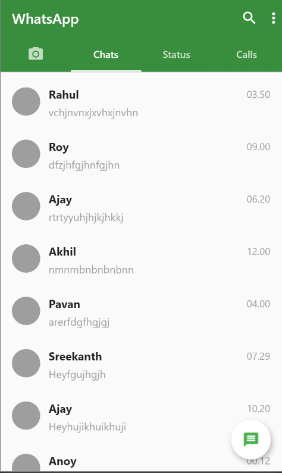
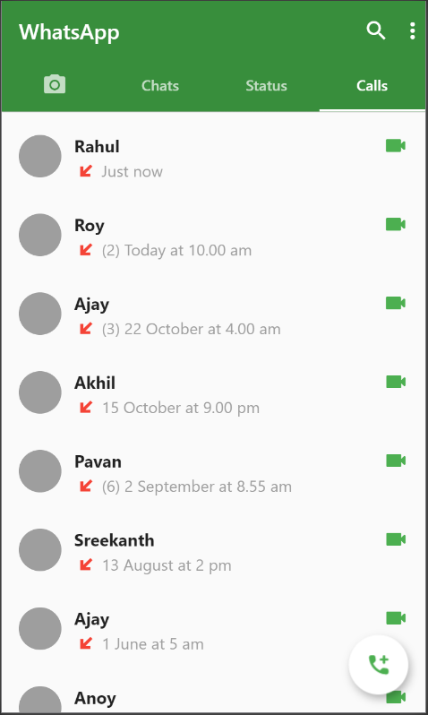
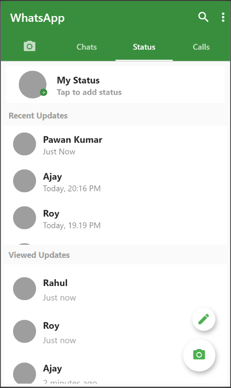

# FlutterWhatsAppClone-UI
Simple WhatsApp Clone (UI) using Flutter.
Anyone can build whatsapp clone easily by using this simple code. Not included any advanced features like camera screen,single status view etc but included all the basic features and structures.
Just try. Best wishes.
Show some support and star the repo.❤

### Screenshots

  

### Created & Maintained By

[GitHub](https://github.com/rihaanrk) [LinkedIn](https://www.linkedin.com/in/mohamed-rihan-k-585056170/)
[Instagram](https://www.instagram.com/rihaanrk) [Twitter](https://twitter.com/MohamedRihanK)

> If you found this project helpful or you learned something from the source code and want to thank me,
> * GooglePay - k.rihan06@okicici
